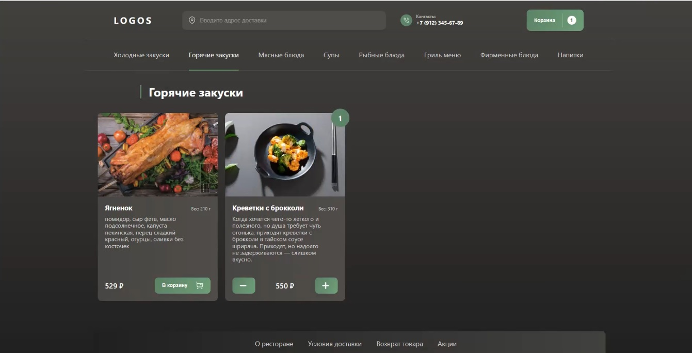

# Resto App

## Опеисание проекта

Resto app это приложение по заказу еды.В проекте используется автодоролнение адреса(только по городу Оренбург), так же интегрированны яндекс карты с флажком места самовывоза.

## Доступные Скрипты

### `npm run server`

* Сервер запускается на порту `3001`

### `npm start`

* Проект запускается на порту `3000`

### `npm run lint:fix`

* Запускает линтер `eslint`.

### `npm run stylelint`

* Запускает линтер стилей `stylelint`.

## Демо

* :point_right: Здесь вы можете [посмотреть](https://resto-react-app.herokuapp.com/) рабочую версиюю проекта.

